  

 

<table align="center" border="0" cellpadding="0" cellspacing="0" style="border: none; border-collapse: collapse;">
  <tr>
    <td width="150" align="center" valign="middle" style="border: none; padding-right: 30px;">
      
    </td>
    <td valign="middle" style="border: none; text-align: left;">
      <h1 style="margin: 0; font-family: -apple-system, BlinkMacSystemFont, 'Segoe UI', Helvetica, Arial, sans-serif; font-weight: 800; font-size: 2.2em;">Arnav Sharma</h1>
      

        Systems Architect &bull; ML Engineer &bull; Low-Level Enthusiast
      

      

        🎓 <strong>NIT Hamirpur</strong> &mdash; Dual Degree (B.Tech + M.Tech), CSE 
        📍 <strong>World Map</strong> &mdash; Solan, Himachal Pradesh, India 
        🧱 <strong>Current Quest</strong> &mdash; Building safety-critical, high-performance systems 
        ⭐ <strong>Power-Up</strong> &mdash; "🙌 Absolute Efficiency 🙌"
      

    </td>
  </tr>
</table>

 

  

  

## 📁 Inventory

 

| **Domain** | **Skills & Technologies** |
| :--- | :--- |
| **Low-Level** | `Rust` `C` `C++` `x86_64 Assembly` `Linux Kernel` |
| **AI & Vision** | `PyTorch` `OpenCV` `TensorRT` `CUDA` `Deep Learning` |
| **Systems** | `Bare-metal OS` `Memory Management` `Distributed Systems` |
| **Dev Tools** | `GDB` `Valgrind` `Perf` `LLDB` `Docker` `Git` |

  

## 🎯 Focus Areas

- **Systems Programming** &mdash; Building memory-safe, high-concurrency engines in **Rust** and **C++**. Zero-cost abstractions, fearless concurrency, and deterministic performance.
- **Computer Vision** &mdash; Optimizing real-time perception pipelines for unstructured environments using **TensorRT**, **CUDA**, and custom inference backends.
- **Kernel Research** &mdash; Implementing OS components from scratch: demand paging, custom schedulers, memory allocators, and AI-assisted fault detection modules.
- **Competitive Programming** &mdash; Pushing the limits of time/space complexity on hard algorithmic problems under strict constraints.

  

## 🏆 Trophy Room

  

  

## 📊 GitHub Stats

  
  

  

## 🔥 Streak

  

  

  

## 📈 Progress Map

  

  

## 🤝 Let's Connect

  

