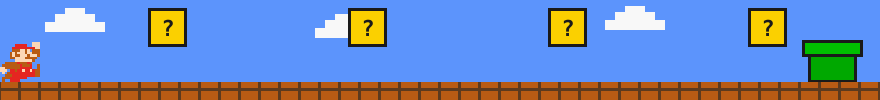

<div align="center">
  
</div>

<div align="center">


<a href="https://readme-typing-svg.demolab.com/">
  
</a>


</div>

<div align="center">
  
</div>

## 🍄 About Me

```
🎮  PLAYER 1  —  NIT Hamirpur — Dual Degree (B.Tech + M.Tech), Computer Science & Engineering
📍  WORLD MAP —  Solan, Himachal Pradesh, India
🧱  CURRENT QUEST —  Building safety-critical, high-performance systems
⭐  POWER-UP  —  "🙌 Absolute Efficiency 🙌"
```

<div align="center">
  
</div>

##  Inventory

<div align="center">


</div>
<br/>

| **Block** | **Power-Ups Collected** |
| :--- | :--- |
| 🧱 **Low-Level** | `Rust` `C` `C++` `x86_64 Assembly` `Linux Kernel` |
| 👁️ **AI & Vision** | `PyTorch` `OpenCV` `TensorRT` `CUDA` `Deep Learning` |
| 🟢 **Systems** | `Bare-metal OS` `Memory Management` `Distributed Systems` |
| 🔧 **Dev Tools** | `GDB` `Valgrind` `Perf` `LLDB` `Docker` `Git` |

<div align="center">
  
</div>

## 🚩 Level Objectives

- 🧱 **Systems Programming** — Building memory-safe, high-concurrency engines in **Rust** and **C++**. Zero-cost abstractions, fearless concurrency, and deterministic performance.
- 👁️ **Computer Vision** — Optimizing real-time perception pipelines for unstructured environments using **TensorRT**, **CUDA**, and custom inference backends.
- 🐧 **Kernel Research** — Implementing OS components from scratch: demand paging, custom schedulers, memory allocators, and AI-assisted fault detection modules.
- 🪙 **Competitive Programming** — Pushing the limits of time/space complexity on hard algorithmic problems under strict constraints.

<div align="center">
  
</div>

## 🏆 Trophy Room

<div align="center">
  
</div>

<div align="center">
  
</div>

## 🪙 Coin Counter — GitHub Stats

<div align="center">
  
  
</div>

<div align="center">
  
</div>

## 🔥 Streak

<div align="center">
  
</div>

<div align="center">
  
</div>

<div align="center">
  
</div>

##  Progress Map

<div align="center">
  
</div>

<div align="center">
  
</div>

##  Flagpole — Let's Connect

<div align="center">

[](https://www.linkedin.com/in/arnav-sharma-z/)
[](mailto:arnav4324@gmail.com)
[](https://github.com/Shardz4)

</div>

<div align="center">
  
</div>
